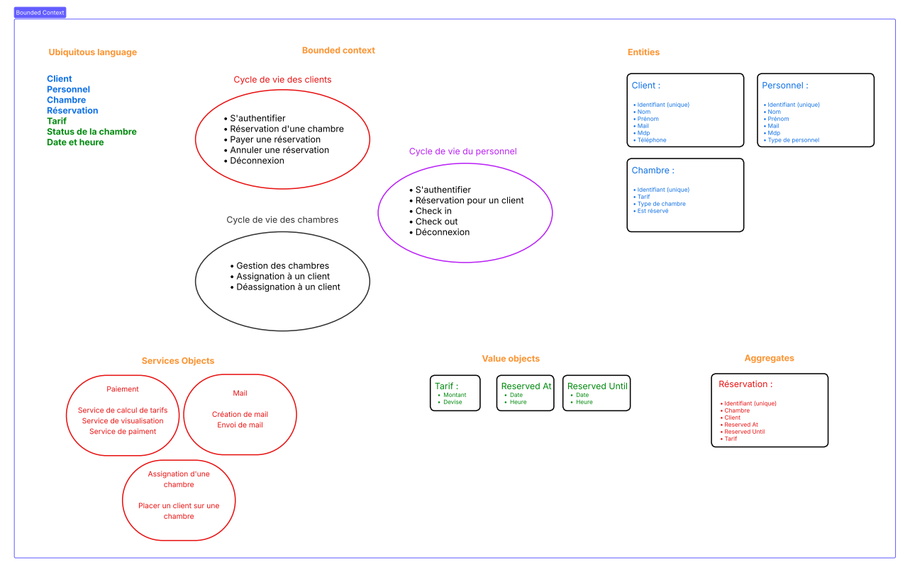
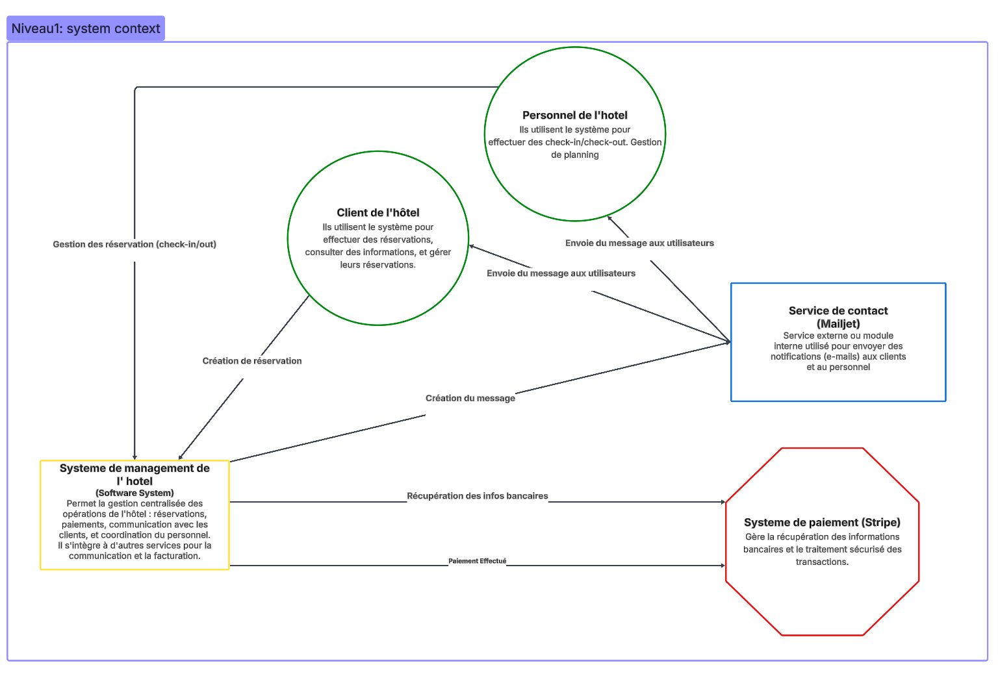
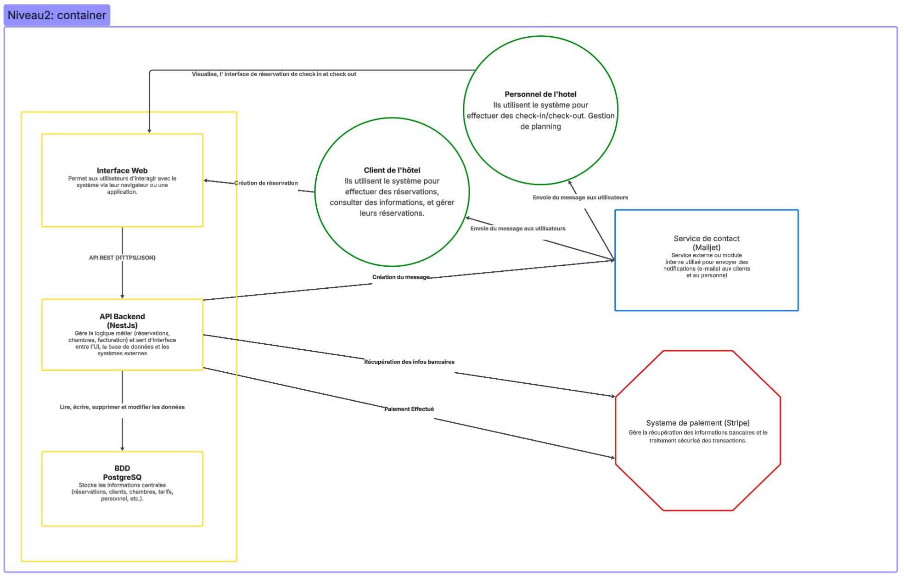
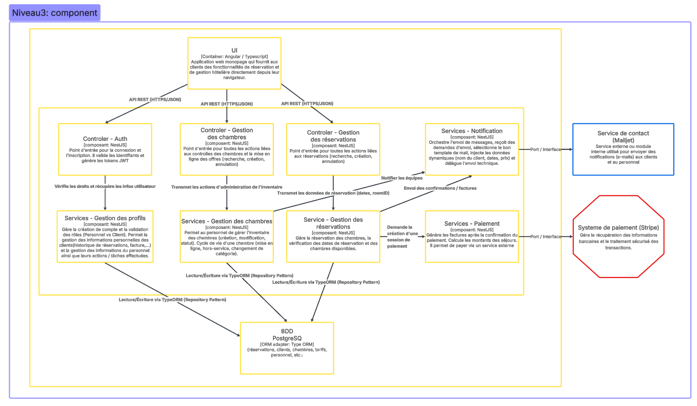

# Y.TELLERIE

## Description Fonctionnelle

Ce projet constitue le socle backend d'une application de gestion hôtelière moderne. L'objectif métier est de fournir une plateforme centralisée permettant de piloter l'activité complète de l'établissement, de la mise en ligne des chambres jusqu'à la finalisation du séjour.

### Cœur du système
L'application orchestre l'ensemble du flux opérationnel de l'hôtel :
* **Gestion du Catalogue & Inventaire** : Administration fine des chambres (catégories, équipements, statut de nettoyage) et gestion de la disponibilité en temps réel.
* **Cycle de Réservation Complet** : Tunnel de réservation incluant la vérification de disponibilité, la gestion des dates et la confirmation ferme.
* **Moteur de Tarification & Paiement** : Calcul dynamique des coûts de séjour et intégration sécurisée avec **Stripe** pour le traitement des transactions en ligne.
* **Communication Transactionnelle** : Système de notifications automatiques via **Mailjet** pour l'envoi des confirmations de réservation et des factures.

### Profils & Parcours Utilisateurs
Le système distingue deux types d'utilisateurs avec des droits et accès spécifiques :
-   **Le personnel de l'hôtel** : Des employés disposant de droits étendus pour la gestion de l'inventaire, la supervision des réservations et l'administration des utilisateurs.
-   **Les clients** : Des utilisateurs externes pouvant consulter le catalogue, effectuer des réservations sécurisées et accéder à leur historique de séjour.

---

## Architecture

L'application est conçue selon les principes de l'**Architecture Hexagonale** (ou Ports & Adapters), favorisant la séparation des préoccupations, la maintenabilité et la testabilité.

### Domaine Métier & DDD

Le cœur du système est découpé selon les principes du Domain-Driven Design (DDD) pour garantir une logique métier pure et isolée :

-   **Bounded Contexts** : Identification claire des frontières entre la gestion des utilisateurs (Authentification/Profils) et la gestion hôtelière (Chambres/Réservations).
-   **Entités & Agrégats** : Utilisation d'entités riches (ex: Chambre) et d'agrégats pour maintenir l'intégrité des données (ex: Réservation).
-   **Value Objects** : Validation stricte des données immuables (ex: Tarif).
-   **Services du Domaine** : Logique métier complexe ne pouvant pas être portée par une seule entité (ex : Paiement).
-   **Application** : Orchestre les cas d'utilisation (Use Cases) en utilisant les objets du domaine. Il définit les "ports" (interfaces) nécessaires pour communiquer avec l'extérieur (ex: base de données, services externes).
-   **Infrastructure** : Implémente les "adapters". C'est ici que se trouvent les technologies externes : contrôleurs API, connexion à la base de données (TypeORM), envoi d'emails, etc.



### Diagramme C4

L'architecture technique est documentée via le modèle C4 pour offrir une vision claire des composants du système.





> **Note :** Le diagramme de Niveau 3 détaille les interactions entre les Contrôleurs (Infrastructure), les Use Cases / services (Application) et les Entités (Domaine).

---

## Manuel Utilisateur

L'API est accessible via l'URL de base `http://localhost:3000`. Une documentation interactive Swagger est également disponible pour explorer et tester les endpoints en direct.

-   **Documentation API (Swagger)** : `http://localhost:3000/api-docs`

---

## Manuel Technique

### Prérequis

-   Docker & Docker Compose
-   Node.js v18+ (LTS)
-   npm v9+

### Installation

1.  Clonez le dépôt du projet.
2.  Copiez le fichier d'environnement d'exemple et remplissez les variables nécessaires :
    ```bash
    $ cp .env.example .env
    ```
3.  Installez les dépendances du projet :
    ```bash
    $ npm install
    ```

### Configuration des Services

Le projet repose sur deux services tiers pour assurer les fonctionnalités critiques de paiement et de communication. Renseignez les clés correspondantes dans votre fichier `.env`.

#### Paiements (Stripe)
L'intégration Stripe sécurise les transactions bancaires et permet la confirmation ferme des réservations.
1. **Création de compte** : Créez un compte sur le [Tableau de bord Stripe](https://stripe.com).
2. **Identifiants API** : Naviguez vers **Développeurs** > **Clés API**.
3. **Clé secrète** : Récupérez la **Clé secrète** (commençant par `sk_test_`).
4. **Webhook (optionnel)** : Configurez un webhook pour suivre les événements d'email si nécessaire. Pour la synchronisation locale, utilisez la CLI Stripe pour obtenir votre secret de signature (whsec_...).
5. **Configuration** : Renseignez les variables suivantes dans le `.env` :
   ```bash
   STRIPE_SECRET_KEY=sk_test_votre_cle_secrete
   STRIPE_WEBHOOK_SECRET=whsec_votre_cle_webhook
   STRIPE_CURRENCY=eur
    ```
   
#### Emails (Mailjet)
Mailjet est utilisé pour l'envoi automatisé des confirmations de séjour et des alertes de gestion des chambres.
1. **Création de compte** : Inscrivez-vous sur [Mailjet](https://www.mailjet.com).
2. **Validation d'expéditeur** : Validez votre adresse email dans la section Adresses d'expéditeurs.
3. **Identifiants API** : Accédez à **Mon compte** > **API Keys**.
4. **Clé** : Récupérez la **Clé API publique** et la **Clé API secrète**.
5. **Configuration** : Renseignez les variables suivantes dans le `.env` :
   ```bash
   MAILJET_API_KEY=your_mailjet_api_key
   MAILJET_API_SECRET=your_mailjet_api_secret
   MAILJET_SANDBOX= true # ou false en production
   MAILJET_SENDER_EMAIL=your_verified_sender_email
   MAILJET_SENDER_NAME=YourSenderName
    ```
#### Base de Données (PostgreSQL & pgAdmin)
Le projet utilise PostgreSQL comme base de données relationnelle. Un service PostgreSQL est configuré via Docker Compose.
1.  Assurez-vous que les variables de connexion à la base de données dans le fichier `.env` correspondent à celles définies dans le `docker-compose.yml` :
    ```bash
    POSTGRES_HOST=your_host
    POSTGRES_PORT=your_port
    POSTGRES_USER=your_user
    POSTGRES_PASSWORD=your_password
    POSTGRES_DB=your_database
    ```
2.  Un service pgAdmin est également configuré pour faciliter la gestion de la base de données via une interface graphique.
3.  Accédez à pgAdmin via `http://localhost:5050` avec les identifiants définis dans le `.env` :
    ```bash
    PGADMIN_DEFAULT_EMAIL=your_email
    PGADMIN_DEFAULT_PASSWORD=your_password
    ```
4.  Ajoutez un nouveau serveur dans pgAdmin avec les paramètres de connexion PostgreSQL du `.env` :
    -   **Nom du serveur** : `PostgreSQL`
    -   **Hôte** : `your_host`
    -   **Port** : `your_port`
    -   **Maintenance DB** : `your_database`
    -   **Username** : `your_user`
    -   **Password** : `your_password`

### Lancement de l'application

Pour lancer l'ensemble des services (API, base de données, pgAdmin) dans un environnement de développement :

```bash
$ docker compose up -d --build
```

L'application sera alors accessible sur `http://localhost:3000`.

### Accès aux services

-   **API (Swagger)** : `http://localhost:3000/api-docs`
-   **pgAdmin (GUI pour la BDD)** : `http://localhost:5050`
-   **API (accès direct)**: `http://localhost:3000`

### Tests

Le projet est couvert à au moins 30% par des tests unitaires utilisant **Jest**. Pour exécuter les tests et vérifier la couverture de code, utilisez les commandes suivantes :

```bash
# Lancer les tests unitaires
$ npm run test

# Calculer la couverture de test
$ npm run test:cov
```

---

## Intégration Continue (CI)

Le projet intègre un pipeline de CI via **GitHub Actions** qui s'exécute à chaque push ou pull request sur la branche `main`. Ce pipeline garantit la qualité du code avant tout déploiement.

**Étapes du pipeline :**
1.  **Checkout** : Récupération du code source.
2.  **Setup Node.js** : Installation de l'environnement (v20.x).
3.  **Install** : Installation propre des dépendances via `npm ci`.
4.  **Tests & Coverage** : Exécution des tests unitaires et vérification de la couverture de code (`npm run test:cov`).

### Base de données et Migrations

Le projet utilise TypeORM pour gérer le schéma de la base de données.

```bash
# Appliquer les migrations en attente
$ npm run migration:run

# Revenir en arrière sur la dernière migration
$ npm run migration:revert

# Générer une nouvelle migration
$ npm run migration:generate -- -n NomDeLaMigration
```

---

## Description Technique

### Langages et Frameworks

-   **Langage** : TypeScript 5.7
-   **Framework principal** : NestJS 11

### Dépendances Externes et Librairies

-   **Base de Données** : PostgreSQL (lancé via Docker).
-   **ORM** : TypeORM pour la modélisation et l'accès aux données.
-   **Authentification** : Passport.js avec des stratégies `local` (email/mot de passe) et `jwt`.
-   **Validation des données** : `class-validator` et `class-transformer` pour la validation et la transformation des DTOs.
-   **API & Documentation** : Swagger (`@nestjs/swagger`) pour la génération automatique de la documentation d'API.
-   **Tests** : Jest pour les tests unitaires.
-   **Qualité de code** : ESLint (linting) et Prettier (formatage).
-   **Gestion des mails** : Mailjet pour l'envoi d'emails transactionnels.
-   **Gestion des paiements** : Stripe pour le traitement des paiements en ligne.